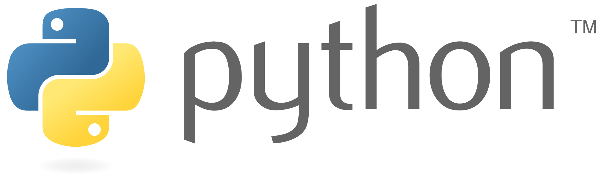
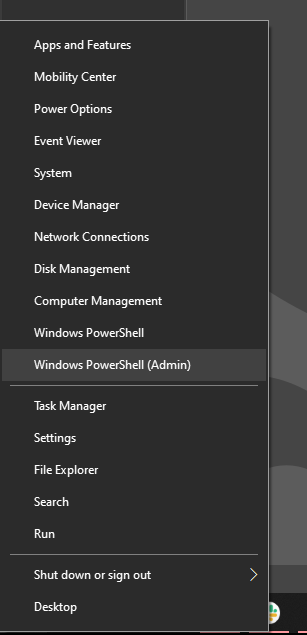

#  Python Installfest

We are going to be installing and configuring [python3](https://www.python.org/) 

Some people may already have python2 installed -- but it is fully deprecated now and we will be exclusively using python3 in class. 

Python3 might also be present on some systems as well, in which case we want to update it.

*You should always just use python3 in general now -- the breaking changes when python updated from version 2 to version 3 are kind of this whole thing, but tldr; the world is now ~~switched~~ switching over to version 3 and so should we!*

We will also be using `pip3`, which is python's package manager, to install a couple tools and finally we will install a vscode extension to help use programing python in code.

Our goal is to have everyone run the command `python --version` in the console and have it say `Python 3.9.2`

## Linux install (deadsnakes ppa)

Most guides recommend using the deadsnakes ppa repo to install python3. 

[here is a guide](https://linuxhint.com/install-python-3-9-linux-mint/) that may be helpful in installing python3 on linux 

## Windows (Chocolatey install)

We are going to be using [chocolatey](https://chocolatey.org/) to install python. Chocolatey is a deliciously named package installation manager for windows powershell that is similar to homebrew for unix based operating systems. Chocolatey commands all start with the command prefix `choco`. You always need to be in a powershell with admin privileges to run chocolatey commands.

___

Our todolist:

1. install the chocolatey package manager
1. use chocolatey to install python3

#### Install Chocolatey

This is adapted from the [chocolatey install instructions.](https://docs.chocolatey.org/en-us/choco/setup)

First, open a powershell with admin privileges. You can do this easily by right clicking the start menu and selecting `Windows Powershell Admin`:



After your admin powershell is open copy and past the following script to install chocolatey.

**Make sure you carefully copy the whole command, because it is long**

*chocolatey will ask you some questions about granting permissions during the install. Say `yes` to to everything by typing a `y` and pressing return.*

```c#
@"%SystemRoot%\System32\WindowsPowerShell\v1.0\powershell.exe" -NoProfile -InputFormat None -ExecutionPolicy Bypass -Command "[System.Net.ServicePointManager]::SecurityProtocol = 3072; iex ((New-Object System.Net.WebClient).DownloadString('https://chocolatey.org/install.ps1'))" && SET "PATH=%PATH%;%ALLUSERSPROFILE%\chocolatey\bin"
```

After chocolatey installs, stay in the same admin powershell and use the following command to install python with chocolatey:

```c#
choco install python
```

*You will recieve many prompts about permsissions during the install. **SAY YES TO ALL OF THEM**. You can type `a` and press return on any prompt to say `yes to all`*


after python installs, check the installation with the following commands:

```bash
# should return python 3.X.X
python --version
```


```bash
# should return pip X.X.X
pip --version
```

You can also open up a `git bash` terminal and check the commands to make sure everything is connected.


## Mac (Homebrew install)

We are going to need to:
1. install `python3` and `pip3` with homebrew
1. alias the `python` an `pip` commands in our `.zshrc` (zshell config file) to point to python3 instead of python2.

#### Installing `python3` and `pip3`

We will be using homebrew to install and manage python3.

___

Tell homebrew to install python with the following command: 

```bash
brew install python
```

Afterwards, run the following command:

```bash
python3 --version
```

If this command returns a version lower than `Python 3.9.2`, tell homebrew to update python with this command:

```bash
brew upgrade python
```

Python uses `pip` as the package manager, similar to how node.js uses `npm`

Double check that `pip3` has been installed on your system with the following command:

```bash
pip3 --version
```

If zshell tells you `pip3` is a command not found, reach out to a dev to troubleshoot this bug. I am putting [this stack overflow](https://stackoverflow.com/questions/47255517/brew-install-python3-didnt-install-pip3) here in case it is helpful to debug this issue for anyone.

#### python 3 aliases

We a going to alias the `python` command to point to python3 instead of python. We can do this by adding a few lines on code to our zshell config file.

___

Run the command `code ~/.zshrc` from anywhere in your terminal to open up the zshell config file (it lives in your home directory and this an an exact path command).

Scroll down to the command aliases area of the file (you can find the different areas by reading the comments) and paste the following lines of shell script in:

```bash
# python3 aliases
alias python=python3
alias pip=pip3
```

Afterwards, save the file and close vscode. Restart your terminal and use the command `python --version` and it should return `Python 3.9.2`.

If it still says `Python 2.blah.blah` you probably forgot to restart your terminal.

## All Systems

Everyone needs to install the following things, regardless of thier operating system.

1. install a couple global python packages with `pip3`
1. install a vscode extension for python

#### Installing Global Packages 

We are going to make sure we have `virtualenv` installed, which is how `pip` manages package versioning in python projects.

We also are going to install `ipython`, which is a tricked out version of the python shell.

___


check to make sure you have virtualenv installed with the following command:

```bash
virtualenv --version
```

if nothing is found, use `pip install virtualenv` ot install virtualenv

run the following command to install ipython, which is a tricked out python shell:

```bash
pip3 install ipython
```

everyone should install [this python vscode extension](https://marketplace.visualstudio.com/items?itemName=ms-python.python) 